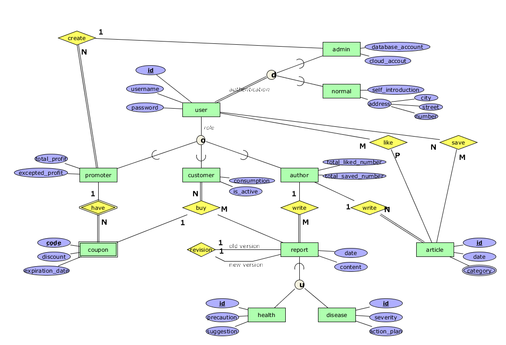

# Database Management system - 2023 spring

## Table of Contents

- [Database Management system - 2023 spring](#database-management-system---2023-spring)
  - [Table of Contents](#table-of-contents)
  - [About ](#about-)
    - [ER Diagram ](#er-diagram-)
  - [Prerequisites ](#prerequisites-)
  - [Usage ](#usage-)

<br>

## About <a name = "about"></a>

The Database Management system course by Prof. Ming-Ling Lo in National Taiwan University in 2023 spring.

### ER Diagram <a name = "ER Diagram"></a>


<br>

## Prerequisites <a name = "prerequisites"></a>
- Download MySQL

<br>

## Usage <a name = "usage"></a>
1.  Move to the directory of the project
2.  Start MySQL
    ```bash
    systemctl start mysql
    ```
3.  Into MySQL monitor
    ```bash
    mysql
    ```
4.  Run the script
    ```bash
    source ./<script>.sql
    ```
